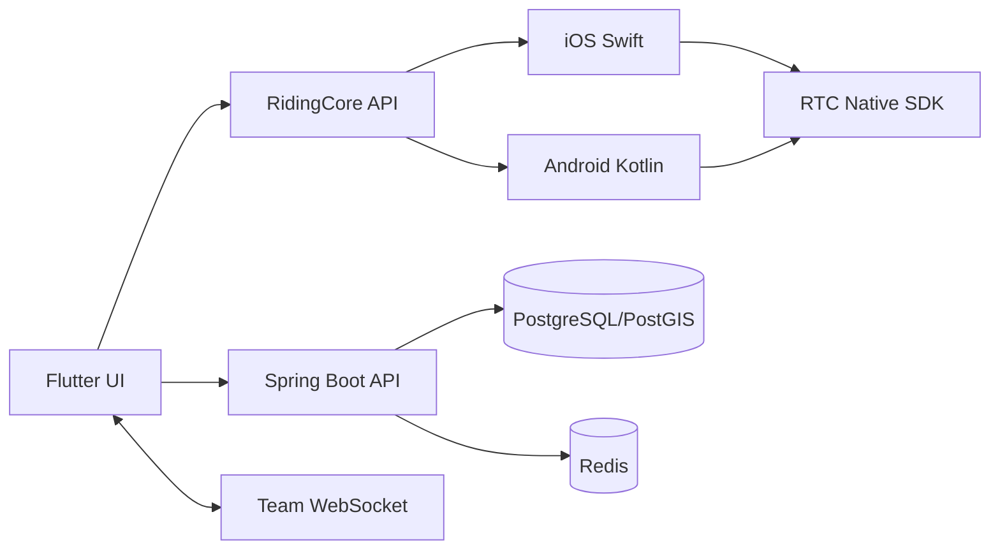
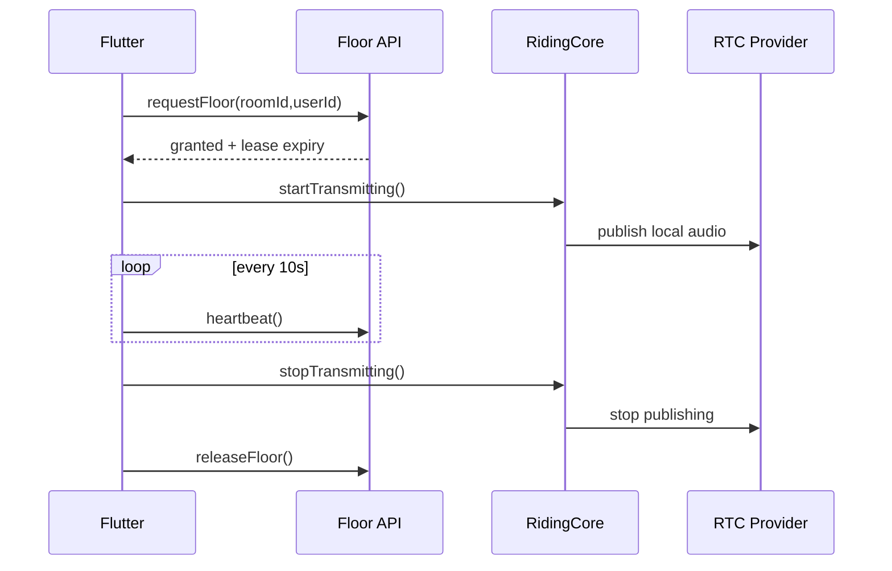

# MVP 架构说明

## 1. 原则

MotoLink 不采用“所有能力都放 Flutter”的方案。业务界面和普通网络逻辑共享；音频会话、前台服务、后台定位、系统生命周期和后续 PushToTalk 接入放在双端原生层。



## 2. 组件职责

### Flutter

- 登录、车队大厅、附近车友、骑行、个人中心；
- 调用 REST API 与 WebSocket；
- 展示按住说话状态；
- 只调用高层 RidingCore 接口，不直接维护后台服务生命周期。

### RidingCore

- iOS：`AVAudioSession`、`CoreLocation`、屏幕常亮；后续接入 `PushToTalk`；
- Android：麦克风/定位 Foreground Service、Audio Focus、网络变化；
- 对外暴露 `startRide`、`joinChannel`、`startTransmitting` 等稳定接口；
- RTC 厂商相关实现不得泄漏到业务页面。

### Spring Boot API

- 用户、房间、成员、骑行与轨迹持久化；
- 麦权租约仲裁；
- RTC 临时 Token 签发边界；
- 管理端统计接口；
- 房间临时事件广播。

### Redis

PTT 麦权使用带 TTL 的租约，不使用永久锁：

```text
motolink:ptt:floor:{roomId} = userId
TTL = 30 seconds
heartbeat = every 10 seconds
```

只有持有者可以续租和释放。断网后 TTL 到期自动回收，避免整支车队永久卡麦。

## 3. PTT 时序



按下后不是录完再发，而是取得麦权后立即实时传输；松手立即停止发布。

## 4. 生产化前必须完成

- 用真实 RTC SDK 替换 mock，并由服务端签发短期 Token；
- iOS 16+ PushToTalk 与锁屏收听/发言 POC；
- Android 主要厂商 ROM 的后台服务和权限 POC；
- 头盔蓝牙耳机、电话打断、网络切换、隧道弱网测试；
- 附近陌生人位置模糊化、查询限频、轨迹删除与审计；
- 鉴权、授权、风控、限流、可观测性与数据备份。
